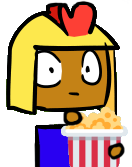

Welcome to the website. If you're going to be sticking around, please don't delete anything that you didn't create. Please don't touch about.md or index.md either - they're the most important parts of the website and without them the whole thing breaks.

So to make a website you're going to need to know some basics. Fool around on this website first, and later on I'll set up another one. This website's code is made in a shared "repository" and I can let people in to view and edit my code. I'll make another repository later for the Mars Base thing.

Here's some stuff you'll need to know. If you want to go into greater detail, [Mastering Markdown](https://guides.github.com/features/mastering-markdown/) is the place to go.
[By the way, these are Emoji codes. You may recognize some of them from Discord.](https://github.com/ikatyang/emoji-cheat-sheet/blob/master/README.md#github-custom-emoji)

```

# Header 1
## Header 2
### Header 3

- Bulleted
- List

1. Numbered
2. List

**Bold** and _Italic_ and `Code` text

> A quote looks like this

:baguette_bread: a delicious French food

[Link Text](url) and  >> Be sure to upload your image to the repository first!

```
All that code ends up looking like this:

# Header 1
## Header 2
### Header 3

- Bulleted
- List

1. Numbered
2. List

**Bold** and _Italic_ and `Code` text

> A quote looks like this

:baguette_bread: , a delicious French food

[Primer (Youtube)](https://www.youtube.com/channel/UCKzJFdi57J53Vr_BkTfN3uQ)


By the way, the roman is watching you. He wants to make a website too but I don't have time to teach him so he just watches people edit the repository until he learns something.
